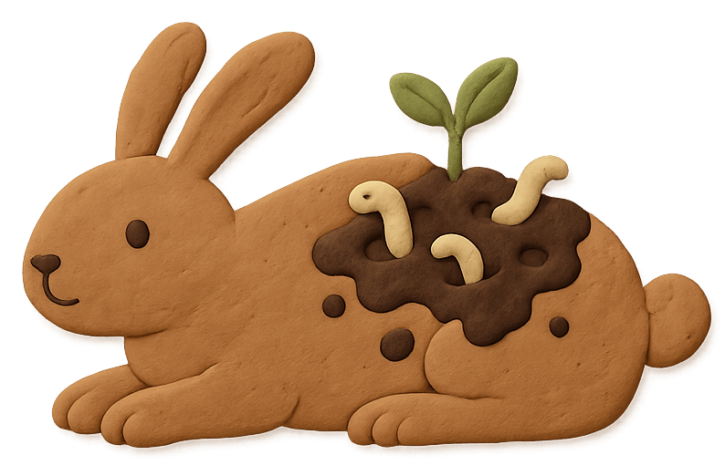
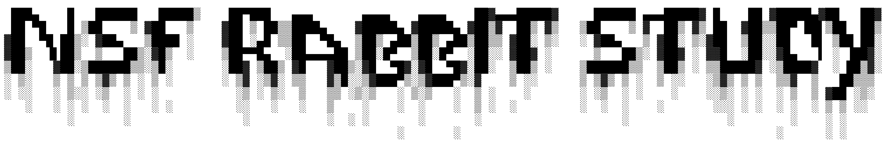
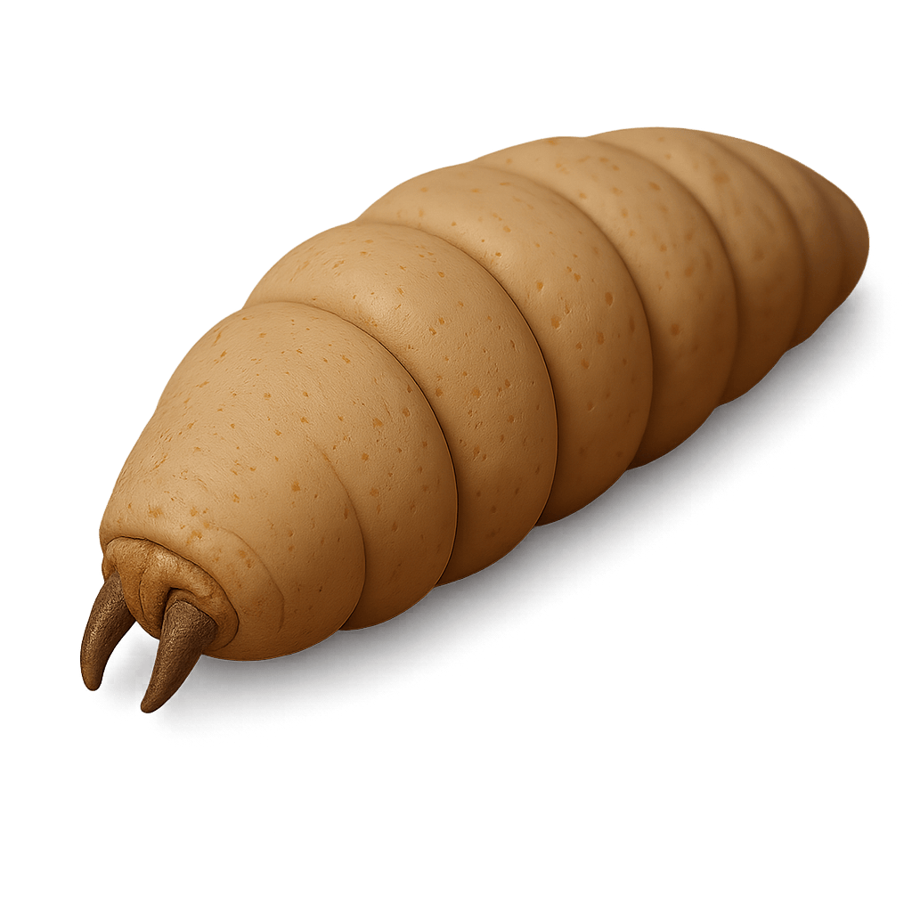
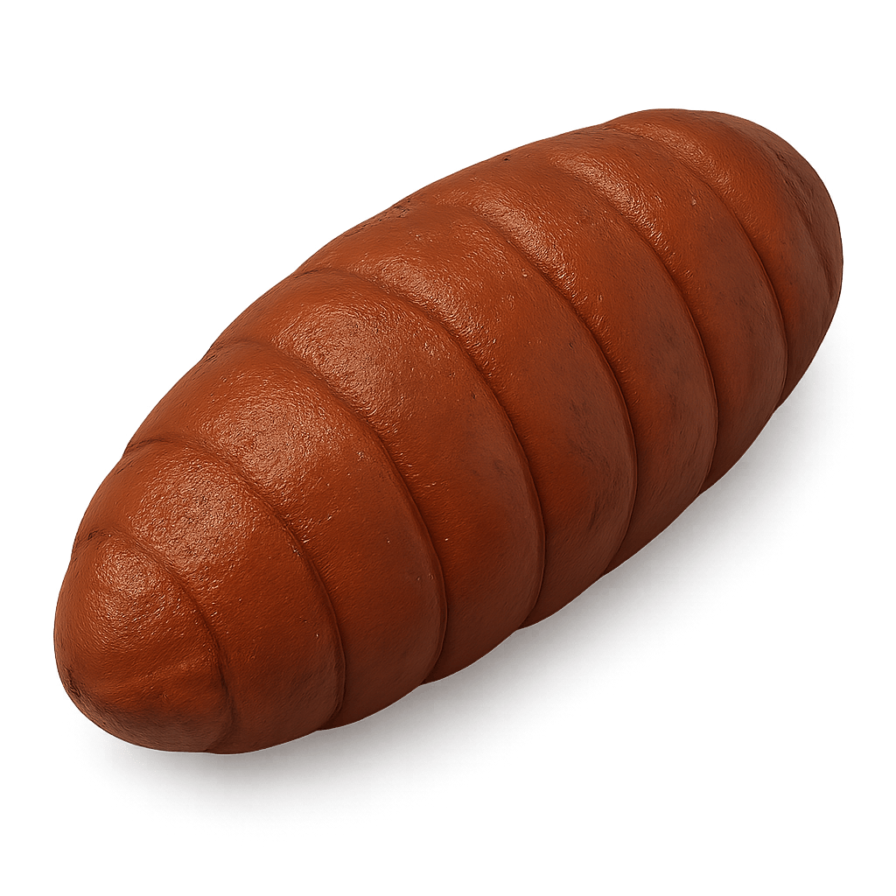
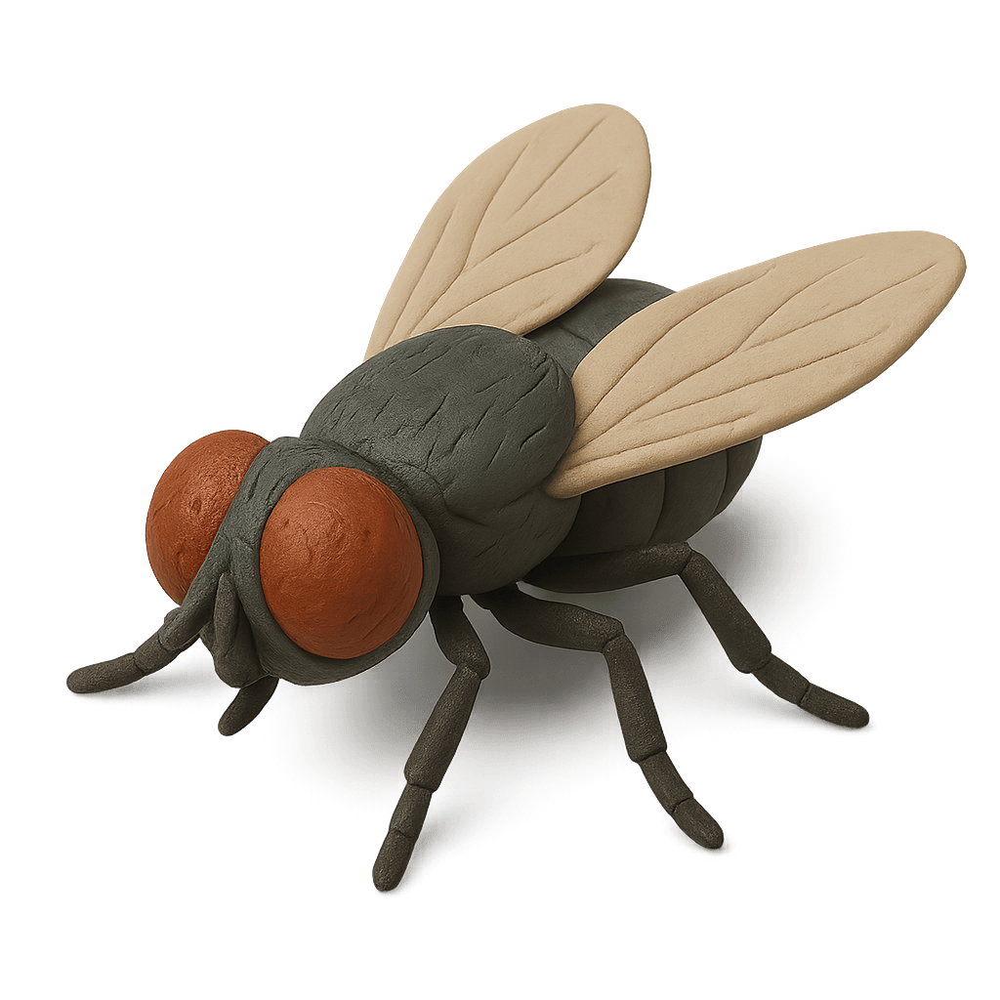
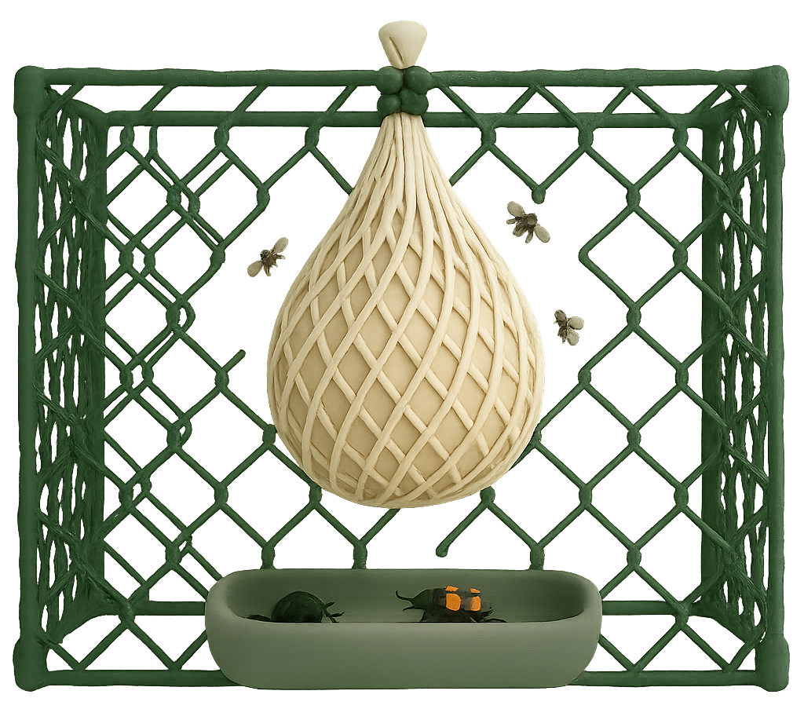

  

  

# About

### What's this for?

This repository serves as an experimental reporting system for documentation, materials, and analyses related to a NSF study investigating the microbial impact varying levels of insect diversity/carrion accessibility has on the microbiota of said carrion. *More specifically, though, the materials here will largely reflect the elements of this study that contribute to my PhD dissertation and research—chiefly the microbiota of decomposition-associated entomofauna and how they compare/intersect.*

  

### A summary of the accessible information and materials:

- Sequencing data (`16S` and `ITS`) and metadata
- Processing, analysis, and visualization scripts (`R` and `pyhton`)
- Figures and data visualizations
- Manuscript drafts/write-ups
- Citations for referenced works/publications
- Supplementary data and figures
- Etc.

  

### Disclosure(s)

The work seen here is the product of a combined effort between Colorado State University's [Metcalf Lab](https://www.jessicalmetcalf.com/) and Sam Houston State University's [Bucheli Lab](https://www.shsu.edu/academics/biological-sciences/people/bucheli.html). The research and data generation was funded by a grant awarded by the National Science Foundation. The work associated with this grant spans far beyond the scope of the project and research discussed in this GitHub repository.

  

### Associated presentations and publications

> [!IMPORTANT]
>
> As of **2025-6-17** this project is still in its infancy, so there are no presentations or publications currently associated with the research materials presented here. This section will be updated with any relevant entries as they're released.
> As of **2025-7-22** the processed sequencing data and QIIME2 processing pipeline documentation have been uploaded.

# Introduction

> [!NOTE] 
>
> TBC

# Methods and Materials

## Study site

### Site set-up

Decomposition studies were performed at the Pineywoods Environmental Researcher Station in Huntsville, Texas. The site featured well-wooded treelines and habored a mix of sandy soil and loamy soil. 

  

Three blocks were assigned at along different plots of the research center, with all conditions featuring some density of trees and uncut grass/vegetation underneath each enclosure.

### Enclosure set-up

Within each block there were 6 cages; and within each cage, 4 rabbits. Each cage represented a replicate wherein individual rabbit was exposed to a specific level of insect diversity (α = 0, 1, 2, and 3). Enclosures consisted of a PVC pipe cage wrapped in low-porosity chicken-wire. Zipties secured the chicken wire to the PVC. When decomposition studies were performed, fine mesh sacks were used to house the rabbits and the soil they decomposed in. These mesh sacks were secured to the top of the cage with bread ties over a foot above the ground beneath them in groups of four per cage. Plastic basins were placed underneath each rabbit to precent the mesh bags from making contact with the ground below during sampling events.

  

## Sampling

### Insect sampling

Insects were sampled opportunistically when observed to be visiting the bait carrion. Visitng blow flies were captured using a sweep net, and visiting *N. surinamensis* were captured by gloved hand. Insect samples used in this study were sampled in a 48 hour window from decomposing remains ranging from fresh to active states of decay. Once collected, blow flies were individually stored in 2mL microcentrifuge tubes and introduced to a styofoam raft inside of a cool packed with ice. Once sufficiently anesthetized, flies were identified to species under a microscope. Beetles observed to be visiting carrion individually were similarly stored in larger 5mL or 15mL tubes depending on their size. If beetles were observed to be visiting a carcass en masse (typically aggregating under and around the sides of carrion), they were stored collectively in 50mL tubes. *N. surinamensis* identification was a simple matter of looking for distinct characteristics unique to just this species (relative to other local species of carrion beetle). *N surinamensis* (n=57) represented the entirety of the beetle population observed and sampled from carrion bait. Visiting blow flies consisted primarily of *Chrysomya rufifacies* (n=20) and *Cochiomyia macellaria* (n=20). Represented in lower abundances were *Chrysomya megacephala* (n=6) and *Lucilia coeruleiviridis* (n=6. Non-Calliphoridae species like *Hydrotea aenescens* (n=3) and *Phoridae spp.* (n=2) were also present at the time of sampling and captured incidentally. Once identified, insects were flash frozen using a mixture of 90 proof ethanol and dry ice and stored at -20°C for further processing.

### Soil sampling

> [!NOTE] 
>
> TBC

### Carcass sampling

> [!NOTE] 
>
> TBC

## Sample processing

  

### Beetle samples

*N. surinamensis* individuals were introduced to fresh, individual 15mL tubes alongside 2mL of sterile PBS. Individuals were then shaken vigorously for 30 seconds before the supernatant was removed and stored in a fresh 2mL tissuelyzer bead tube. Beetles were then subject to a surface sterilization procedure, wherein they were agitated in 70% ethanol for 30 seconds, then again in distilled water three times for 30 seconds each. Once washed, beetles were transferred from their tubes to squares of parafilm for dissection. Sterile forceps were used to separate their heads and thorax from their abdomens, with their midguts delicately removed alongisde them. The head, thorax, and midguts were stored independently of the abdomens in 2mL tissuelyzer bead tubes. Body parts were homogenized using sterile silicone pestles before being subjected to additional bead-beating.

### Fly samples

Fly samples were surface-sterilized much the same way as the beetles were, with the exception of being subjected to gross dissection. Exogenous microbiota, as represented by the initial PBS wash, was similarly procured and stored after agitating whole flies in the solution for 30 seconds.

### Soil samples

> [!NOTE]
>
> TBC

### Carcass samples

> [!NOTE]
>
> TBC

## DNA sequencing

### 16S

> [!NOTE]
>
> TBC

### ITS

> [!NOTE]
>
> TBC

## Sequence processing

  

See [documentation/data_processing.md](documentation/data_processing.md) for more information.
  
### QIIME2 pipeline

> [!NOTE] 
>
> TBC

## Analysis

### Alpha diversity

> [!NOTE] 
>
> TBC

### Beta diversity

> [!NOTE] 
>
> TBC

### Taxonomic composition

> [!NOTE] 
>
> TBC

### Differential abundance

> [!NOTE] 
>
> TBC

### Co-occurence networks

> [!NOTE] 
>
> TBC

### Source-tracking

> [!NOTE] 
>
> TBC

### Machine learning

> [!NOTE] 
>
> TBC

# Results

> [!NOTE] 
>
> TBC

# Discussion

> [!NOTE] 
>
> TBC

# Citations

> [!NOTE] 
>
> TBC
